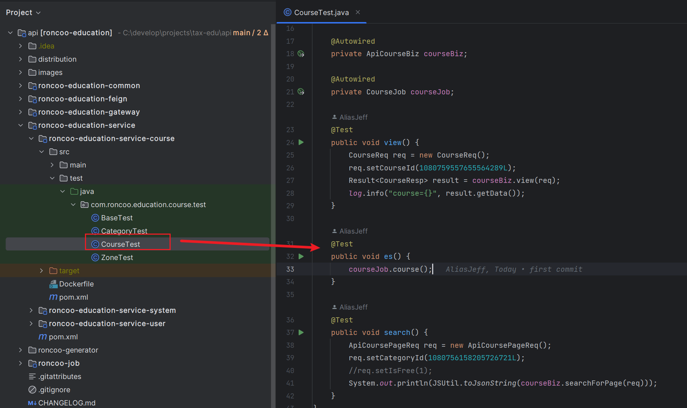

<div align=center>
    
    <div align=center>    
        <a href="http://spring.io/projects/spring-boot">
            
        </a>
        <a href="https://spring.io/projects/spring-cloud-alibaba">
            
        </a> 
    </div>
</div>
## 项目介绍

领课教育系统（roncoo-education）是基于领课网络多年的在线教育平台开发和运营经验打造出来的产品，致力于打造一个各行业都适用的分布式在线教育系统。系统采用前后端分离模式，前台采用vue.js为核心框架，后台采用Spring Cloud为核心框架。系统目前主要功能有课程点播功能，支持多家视频云的接入，课程附件管理功能，支持多家存储云的接入，可以帮助个人或者企业快速搭建一个轻量级的在线教育平台。

* 所有使用到的框架或者组件都是基于开源项目，代码保证100%开源。
* 系统功能通用，无论是个人还是企业都可以利用该系统快速搭建一个属于自己的在线教育平台。
* 如需商业技术服务支持，可使用 [领课教育系统商业版](https://www.roncoo.net/)，功能更丰富，架构更健壮，VIP服务，上线快速。
* 友情链接：领课教育系统的视频云服务基于 [保利威视频云](https://my.polyv.net/v3/register/?f=qd=lingke) 实现，通过链接注册即可免费试用。

## 前台主要功能介绍

* 首页功能：导航模块，轮播模块，专区模块，友情链接，底部信息
* 课程中心：搜索功能，分类导航（自定义分类设置），课程列出
* 课程详情：课程信息，课程目录，讲师信息、购买、播放等功能
* 个人中心：我的课程，我的订单，个人信息

  
  

## 后台主要功能介绍

* 权限管理功能：菜单多角色多用户自定义管理
* 系统配置功能：自定义进行站点配置及第三方参数配置
* 讲师管理功能：讲师列出、添加、修改、删除等功能
* 课程分类管理：分类列出、添加、修改、删除等功能
* 课程管理功能：课程列出、添加、修改、删除等功能
* 订单管理功能：订单的列出，对订单进行分析统计功能
* 用户管理功能：同一时间只允许同一个账号在同一个浏览器登录，防止账号共享
* 轮播管理功能：后台自定义轮播设置，增加营销效果
* 支付功能模块：对接官方支付宝、官方微信
* 其他功能模块：菜单导航功能、友情链接功能等

  
  

## 演示地址

* [前端门户演示地址：https://eduos.roncoo.net/](https://eduos.roncoo.net/)
* [后台管理演示地址：https://eduos.roncoo.net/admin](https://eduos.roncoo.net/admin/)
* [项目帮助文档地址：https://eduos.roncoo.net/doc](https://eduos.roncoo.net/doc/)

## 项目部署

### 1. 运行环境

| 软件          | 版本   | 说明                                                         |
| ------------- | ------ | ------------------------------------------------------------ |
| JDK           | 1.8.x  | [https://www.oracle.com/java/(opens new window)](https://www.oracle.com/java/) |
| Nodejs        | 16.x   | [https://nodejs.org/zh-cn/(opens new window)](https://nodejs.org/zh-cn/) |
| MySQL         | 8.0.x  | [https://www.mysql.com/(opens new window)](https://www.mysql.com/) |
| Redis         | 3.2+   | [https://redis.io/(opens new window)](https://redis.io/)     |
| Nacos         | 2.2.3  | [https://nacos.io/zh-cn/(opens new window)](https://nacos.io/zh-cn/) |
| Seata         | 1.6.1  | [https://seata.io/zh-cn/(opens new window)](https://seata.io/zh-cn/) |
| XXL-JOB       | 2.3.1  | [https://www.xuxueli.com/xxl-job/(opens new window)](https://www.xuxueli.com/xxl-job/) |
| Elasticsearch | 7.15.2 | https://www.elastic.co/cn/                                   |

> node 必须 16 版本，如果本地有其他版本，建议安装 nvm 进行版本控制
>
> XXL-JOB 包含在项目中了，不需要再安装；其他需要自行安装

### 2. 执行 sql 脚本

先创建跟 sql 文件同名的数据库，每个数据库分别执行 scripts 目录下对应的 sql 脚本

### 3. Nacos 注册中心配置

1. 高版本的nacos默认不开启鉴权，需要手动配置

   找到 nacos/conf/application.properties 修改如下配置：

   ```properties
   ### If turn on auth system:
   nacos.core.auth.enabled=true
   nacos.core.auth.username=nacos
   nacos.core.auth.password=nacos
   
   ### worked when nacos.core.auth.system.type=nacos
   ### The token expiration in seconds:
   nacos.core.auth.plugin.nacos.token.cache.enable=false
   nacos.core.auth.plugin.nacos.token.expire.seconds=18000
   ### The default token (Base64 String):
   nacos.core.auth.plugin.nacos.token.secret.key=${NACOS_AUTH_TOKEN:SecretKey01234567890123456789012345345678999987654901234567890123456789}
   ```

   

2. 改为单机启动（不需要集群）：

   nacos/bin/startup.cmd 

   ```
   set MODE="standalone"
   ```

3. 运行 startup.cmd 启动 nacos

   登录管理后台 默认地址：http://localhost:8848/nacos 默认账号密码：nacos/nacos

4. 新建命名空间 (dev)

   

5. 导入配置

   选择命名空间，导入 scripts/nacos_config.zip

   

   导入之后需要修改对应的配置，例如：MySQL账号密码，Redis密码

   注意 MySQL 密码需要先加密（如果你的密码是12345678，可以沿用我的配置），加密方法如下：

   

   输入密码，执行该test类，输出加密后的密码

### 4. 后端项目配置

修改各个微服务的 bootstrap.properties，改为自己本地的配置，不要改端口号

### 5. Elasticsearch 配置

> 如果 es 占用内存太大，可以修改 config/jvm.options 里面的配置 Xms 和 Xmx，设置为 512m 即可

启动 es 后，运行该方法，同步课程数据到 es



### 6. 后端项目启动

> 如果同时启动所有应用很耗内存，可以控制应用内存的大小，分配256M即可。

启动 Redis, Nacos, Seata, Elasticsearch

启动后端各微服务


### 7. 前端项目安装和启动

web 和 admin 两个项目

1. 安装依赖 (node 16 版本)

   ```
   npm install
   ```

2. 启动项目

   ```
   npm run dev
   ```

admin： 

端口 9528

账号 18800000000

密码 123456

web：

端口 3000

账号 13095632526 （可以自己创建一个账号，手机号验证码在后端日志查看）

密码 123456
